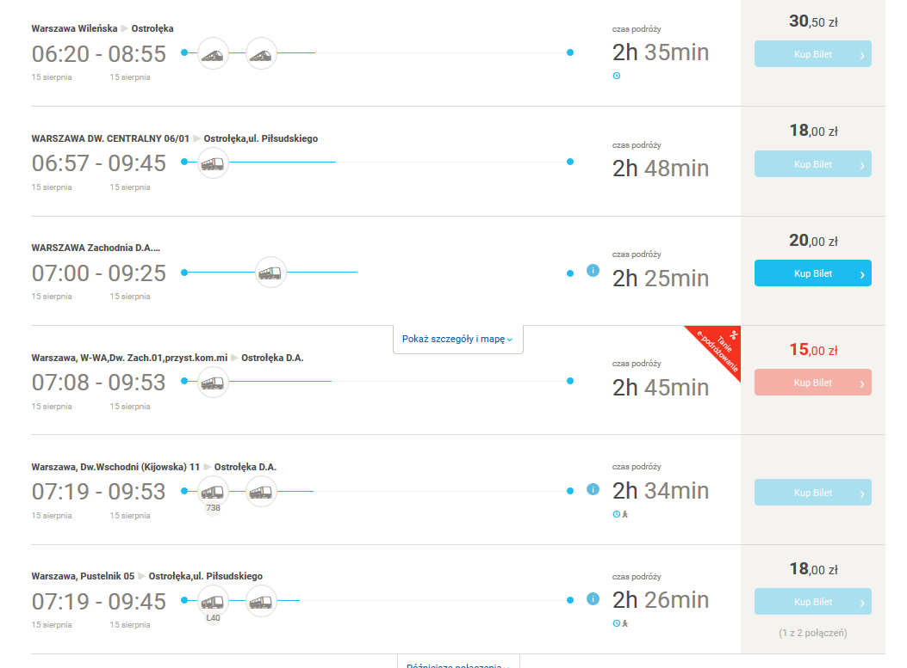

= Ostrołeka

Konto do rowerów ostrołęckich

Ostro-bike 

Hamilkar Barkas
bomilkar96@gmail.com

Atrakcję turystyczne

=== Warszawa --> Ostrołęka 

https://www.e-podroznik.pl/public/searchingResultsVW.do?startCity=Warszawa&forward=url&tabToken=195551dc35d0b4a1a4fa20af9e51b820&toV=c%7C62984&endCity=Ostro%C5%82%C4%99ka&fromV=c%7C54041&tseVw=regularP

=== Informacja Turystyczna

 Informację turystyczną zapewnia Stowarzyszenie Rozwoju Turystyki i Rekreacji mieszczące się przy ulicy Bogusławskiego 18 naprzeciwko dworca autobusowego.

==== Adresy lokali z jedzeniem domowym:

Restauracja Elba, ul. Przemysłowa.

Restauracja Augustyniak, ul. Graniczna.

Tani Bar, ul. Kilińskiego.

Diamentowa, ul. Kilińskiego.

Zabytkowa, ul. Głowackiego.

=== Obchody wojska polskiego

 W czwartek 15 sierpnia 2019 uroczystości zaczną się na Cmentarzu Parafialnym w Ostrołęce, gdzie o godzinie 9:00 odbędzie się uroczyste złożenie kwiatów na Grobie Nieznanego Żołnierza.

 Następnie o godzinie 10:00 w kościele pw. Zbawiciela Świata odprawiona zostanie Msza Święta w intencji Wojska Polskiego. Po nabożeństwie będą złożone kwiaty na ołtarzu upamiętniającym poległych w walkach Żołnierzy Armii Krajowej.

 O godzinie 16:00 na scenie przy D.H Kupiec odbędzie się koncert Orkiestry Dętej Ochotniczej Straży Pożarnej w Ostrołęce. 

=== Miejsca, w których można zakupić pamiątki:

  Świat Prezentów, Handlowiec, ul. Prądzyńskiego 4 lok. 28 (I piętro): lalki kurpianki, kubki, breloki, magnesy, opaski, zegary, zestawy solniczka i pieprzniczka itp.;

  księgarnia w Galerii Bursztynowej, ul. gen. Augusta Emila Fieldorfa "Nila" 28;

  księgarnia "Dom Książki", ul. Głowackiego 35;

  księgarnia szkolno-pedagogiczna "Oświata", ul. Goworowska 1: kubki, podkładki, pocztówki, magnesy, torby;

  Poczta Polska, ul. Mikołaja Kopernika 9;

  Muzeum Kultury Kurpiowskiej, pl. gen. Józefa Bema 8;

  Sekunda, ul. gen. Augusta Emila Fieldorfa "Nila"  5c/2: torby, pudełka, ramki na zdjęcia, breloczki, kubki, maskotki, zegary;

  księgarnia "Dom Książki", ul. Głowackiego 35: kubki, torby, magnesy, breloki, koszulki, porcelana.

  Związek Kurpiów co jakiś czas wydaje nowe książki na temat języka kurpiowskiego. W 2017 roku została wydana przełomowa publikacja: podręcznik z ćwiczeniami do nauki języka kurpiowskiego. Książki wydane przez Związek Kurpiów mogą być nie tylko wyjątkową pamiątką, ale także doskonałą lekturą. Inne ciekawe publikacje to m.in. Śpiewnik kurpiowski, który zawiera ponad 200 pieśni i przyśpiewek kurpiowskich.
  
=== Zabytki 

 Kościół Nawiedzenia Najświętszej Maryi Panny i św. Mikołaja - ul. Szwedzka 2. Kościół potocznie zwany kościołem farnym, bądź farą. Uznawany jest za jeden z najcenniejszych zabytków Ostrołęki. Powstał w 1399 roku, pierwotnie w stylu gotyckim.

  Sanktuarium pw. Świętego Antoniego Padewskiego - ul. Gomulickiego 1A. Kościół został oddany do użytku w 1696 roku. Został zbudowany w stylu barokowym. Kościół wchodzi w skład zespołu poklasztornego. W jego podziemiach znajdziemy jedne z największych w tej części Polski krypty z grobowcami osób związanych z Klasztorem Bernardynów i miastem. Od 2007 roku w Sanktuarium są relikwie św. Antoniego z Padwy.

  Kościół pw. św. Wojciecha - aleja Wojska Polskiego 44. Został zbudowany w 1890 roku początkowo jako cerkiew pw. św. Piotra i św. Pawła. Podczas I i II wojny światowej wykorzystywany był przez Niemców jako magazyn wojskowy.

  Klasycystyczny ratusz - pl. gen. Józefa Bema 1. Ratusz powstał w 1824 roku jednak uległ zniszczeniu podczas I wojny światowej i został odbudowany w 1924 roku. Obecnie znajduje się w nim siedziba Urzędu Miasta.

  Grodzisko wczesnośredniowieczne - Susk Nowy. Gród obronny otoczony wałem o średnicy 90 m (prawdopodobnie z XII lub końca XI w.). Obok grodu funkcjonowała osada przygrodowa, w której była karczma i targ. W tym miejscu powstało wczesne miasto.

 Muzeum Kultury Kurpiowskiej - budynek pochodzi z początku XIX w. Niegdyś znajdowała się w nim poczta. Prawdopodobnie stacjonował w nim Napoleon Bonaparte.
  
  
=== Atrakcje turystyczne 

	Deby Katyńśkie Dęby rosną obok Pomnika Ofiar Terroru Komunistycznego. Posadzono je 17 września 2009 roku podczas uroczystości upamiętniających napaść ZSSR na Polskę, w hołdzie ośmiu zamordowanym na Wschodzie 
 
   "Piaski", ul. Prądzyńskiego/Inwalidów Wojennych - jest to ostatnie miejsce dawnego handlu, prymitywnego targowiska, które lata świetności miało aż do 2014 (!) roku. Część kupców wciąż sprzedaje na nieuporządkowanym terenie własne wyroby, warzywa lub handluje ubraniami. Przez mieszkańców teren ten nazywany jest także Bangladeszem. W przeszłości targowisko było kilkukrotnie większe i zajmowało powierzchnię około półtora hektara. W latach 90. część handlarzy zmuszono do zmiany miejsca handlu, a na części targowiska powstał duży parking. W 2012 roku rozpoczęto prace nad budową dwupoziomowej hali targowej, która stanęła w miejscu istniejącego od lat targowiska. Niewielka część raczej okazjonalnych kupców nie wprowadziła się do otwartej w 2015 roku hali targowej i wciąż handluje na tzw. Piaskach, czyli gruncie należącym do prywatnego właściciela.

  Multimedialne Centrum Natura, ul. Natury 7 - instytucja edukacyjna przeznaczona głównie dla dzieci i młodzieży. Odwiedzając Centrum, możemy dowiedzieć się, jak dbać o środowisko oraz jak mądrze gospodarować zasobami przyrody. Obiekt wyposażony jest w salę doświadczeń, ogród, który znajduję się na dachu budynku oraz ekran 360 stopni do projekcji filmów w przestrzeni wirtualnej 5D. Odwiedzając Centrum, mamy możliwość obejrzenia filmu W królestwie Wielkiego Suma, który ukazuje nam życie w Narwi. Kontakt: tel. 516 491 060.

   Pomnik Mauzoleum żołnierzy poległych w bitwie pod Ostrołęką 26 maja 1831 roku (Forty Bema) - ul. Warszawska 2a. Godziny otwarcia: w sezonie letnim (kwiecień - wrzesień) wtorek - piątek: 10:00 - 17:00, sobota - niedziela: 12:00 - 19:00; godziny otwarcia w sezonie zimowym (październik - marzec): wtorek - niedziela: 10:00 - 15:00. Ceny biletów wahają się od 5 zł za bilet ulgowy do 8 zł za bilet normalny. Istnieje możliwość zakupu biletu rodzinnego za 15 zł. W niedzielę wstęp do obiektu jest bezpłatny.

  Galeria Ostrołęka, pl. gen. J. Bema 14 - galeria sztuki, w której możemy obejrzeć dzieła zaproszonych gości, jak i lokalnych artystów. W galerii organizowane są również zajęcia z różnych technik plastycznych dla dzieci, młodzieży i dorosłych. Na wernisaże i wystawy: wstęp wolny.

  Ostrołęckie Centrum Kultury, ul. Inwalidów Wojennych 23 - w holu zawsze znajdziemy czasową wystawę fotografii bądź malarstwa. Wstęp bezpłatny.

  Most kolejowy - wyłączony z ruchu pociągów pasażerskich od 9 czerwca 2001 r. Drogę do mostu kolejowego można pokonać dwukilometrową ścieżką prowadzącą spod nowego mostu (im. Antoniego Madalińskiego). Most jest popularny ze względu na liczne sesje zdjęciowe nowożeńców oraz jako urokliwa sceneria do teledysków muzycznych.

  Most im. Antoniego Madalińskiego, którego projekt był wzorowany na moście Barqueta w Sewilli.

  Pomnik gen. Józefa Bema na placu Bema - pomnik bohatera bitwy pod Ostrołęką 26 maja 1831 r.

 Pomnik w formie "ławeczki" dr-a Józefa Psarskiego, który znajduje się na skwerze przy ul. Kościuszki.

  Pomnik "Czwartaków", którzy walczyli w bitwie pod Ostrołęką, znajdujący się w okolicy Kościoła pw. Świętego Antoniego Padewskiego (ul. Staszica).

  Pomnik gen. Ludwika Kickiego we wsi Kruki pod Ostrołęką. Pomnik powstał w hołdzie poległemu w bitwie pod Ostrołęką 26 maja 1831 r. generałowi Ludwikowi Kickiemu, który został uznany za jednego z bohaterów powstania listopadowego.

  Pomnik bohaterów szarży artyleryjskiej, ul. Fortowa - pomnik powstał w 1931 r. i miał na celu upamiętnienie szarży artylerzystów konnych dowodzonych przez gen. Bema w czasie bitwy pod Ostrołęką.

  Pomnik Ofiar Terroru Komunistycznego, skwer Lecha Kaczyńskiego/ul. Rejtana - pomnik powstał w hołdzie pomordowanym żołnierzom antykomunistycznego podziemia zbrojnego oraz mieszkańcom cywilnym ziemi ostrołęckiej i został odsłonięty w 2008 roku przez prezydenta Lecha Kaczyńskiego. W 2009 roku, w rocznicę napaści ZSRR na Polskę, nieopodal posadzono Dęby Katyńskie, aby upamiętnić ośmiu oficerów zamordowanych w Katyniu, Miednoje i Smoleńsku.

  Izba Tradycji 5 Pułku Ułanów Zasławskich w Zespole Szkół Zawodowych nr 2 w Ostrołęce.

  Mogiła Wiery Bielik i Tatiany Makarowej znajdująca się na Cmentarzu Żołnierzy Radzieckich na osiedlu Wojciechowice przy ul. Dywizjonu 303 - bohaterskie pilotki latające w 588 Nocnym Pułku Bombowym (potocznie nazywanym pułkiem nocnych wiedźm) zginęły podczas powrotu z lotu nad Ostrołęką. Samolot został zaatakowany przez niemiecki myśliwiec.

  Skwer z zabytkową lokomotywą PX48 przy dworcu PKP (osiedle Stacja, ul. Żeromskiego) oraz tablica upamiętniająca kolejarzy węzła ostrołęckiego więzionych, poległych i pomordowanych przez Niemców, Sowietów i Urząd Bezpieczeństwa PRL w latach 1939-1956.

  Warto również podczas swojego letniego pobytu w mieście odwiedzić plażę miejską, na której czeka plac zabaw dla najmłodszych, strzeżone kąpielisko oraz pływający pomost. Podczas porannych spacerów wzdłuż Narwi możemy ujrzeć okolicznych wędkarzy oraz amatorów fotografii.
  
=== stacje do napraw
 
 Lokalne władze zadbały o stacje naprawy rowerów, które zawierają najważniejsze narzędzia (klucze płaskie, imbusy) i pompkę do kół. Stacje ustawiono przy al. Jana Pawła II koło ronda Zbawiciela Świata (od strony ul. Pileckiego) oraz przy ścieżce rowerowej przy parkingu nowej pływalni przy ul. Witosa, w pobliżu stadionu miejskiego.
 
=== Bitwa pod Ostrołęką

Wiosna 1831 r. przyniosła serię zwycięstw Polaków w zmaganiach z armią rosyjską, której zadaniem było stłumienie powstania w Królestwie Polskim. Ofensywa rozpoczęła się z powodzeniem pod Wawrem i Dębami Wielkimi 31 marca 1831 r. Już 10 kwietnia w bitwie pod Iganiami Polacy mogli sprawić, że Rosjanie zostaliby zmuszeni do wycofania się z granic Królestwa. Zabrakło woli ostatecznego pobicia przeciwnika ze strony głównodowodzącego polską armią gen. Jana Skrzyneckiego. Nie zdobywając ważnych strategicznie Siedlec, generał zdecydował się na przerwę w działaniach. 12 maja, omijając Warszawę, przez Serock i Długosiodło ruszył przeciwko korpusowi doborowej carskiej gwardii, która stacjonowała w okolicy Łomży i Zambrowa. W tej wyprawie znowu dała o sobie znać opieszałość gen. Skrzyneckiego. Rosjanie niepobici umknęli z Królestwa.

Polacy stanęli obozem pod Ostrołęką. 26 maja 1831 r. doszło do bitwy głównych sił obu stron. Ostrołęka została zaatakowana przez armię feldmarszałka Iwana Dybicza. Rosyjskie oddziały wdarły się od wschodu i południa do miasta, wypierając waleczne polskie pułki, w tym między innymi wiarusów sławnego 4 pułku - czwartaków. Polacy ponieśli w walkach ulicznych ciężkie straty i wycofali się na drugi brzeg Narwi. Niestety nie byli w stanie zniszczyć dwóch mostów, dzięki którym Rosjanie szybko osiągnęli drugi brzeg rzeki. Niepomny na uwagi swojego uzdolnionego szefa sztabu, gen. Ignacego Prądzyńskiego, Skrzynecki usiłował wszelkimi sposobami wyprzeć Rosjan z prawego brzegu Narwi. Plan wciągnięcia żołnierzy Dybicza w zasadzkę nie został zrealizowany. W trakcie wielogodzinnej walki strona polska wykrwawiła się solidnie. Zginęli dwaj generałowie: Ludwik Kicki i Henryk Kamieński. Pod koniec morderczego boju brawurowa szarża polskiej baterii artylerii konnej ppłka Józefa Bema (późniejszego generała, bohatera powstania węgierskiego) udaremniła próbę przedarcia się przez Narew oddziałów rosyjskiej kawalerii.

Bitwa pozostała nierozstrzygnięta. Polacy stracili w niej ponad 6 tys. żołnierzy. Straty rosyjskie oceniano na niespełna 5 tys. ludzi. Starcie pod Ostrołęką mogło zakończyć się polskim zwycięstwem. Taką nadzieję dawał plan gen. Prądzyńskiego. Jego pomyślna realizacja zmusiłaby Rosjan do odwrotu. Niektórzy historycy utrzymują, że Królestwo Polskie miałoby wówczas szanse na odzyskanie niepodległości lub przynajmniej zyskanie autonomii, pozostając tylko pod nominalnym zwierzchnictwem cara. Z taktycznego punktu widzenia nierozstrzygnięty bój pod Ostrołęką okazał się strategiczną porażką. Otworzył serię nieudanych polskich wypraw i przegranych bitew. Pogrzebał nadzieje na to, że powstanie (nazwane później listopadowym) mogło mieć szanse na pomyślny finał.

W miejscu gdzie doszło do najcięższych walk stoi dzisiaj pomnik-mauzoleum poległych w bitwie. Nie zdążono ukończyć jego budowy na stulecie bitwy w 1931 r. Dzisiaj sprawia wrażenie zapomnianego zabytku. Pobazgrane ściany i ogólny stan półruiny dziwią, a nawet oburzają. Mauzoleum znajduje się przy ulicy Warszawskiej (droga krajowa nr 61), na terenie pozostałości dawnego rosyjskiego fortu z końca XIX w stanowiącego jedną z kluczowych atrakcji turystycznych w mieście. Ulicą Fortową biegnącą obok fortecznej fosy można dojść do miejsca, gdzie szarżowali słynni artylerzyści ppłka Bema. Wydarzenie upamiętnia ustawiony na pagórku pomnik z 1931 r. Warto pojechać także do wsi Kruki gdzie znjaduje się mogiła z nagrobkiem gen. Ludwika Kickiego. Prawdopodobne miejsce pochówku gen. Henryka Kamieńskiego, oznaczone krzyżem, znajduje się na terenie prywatnej posesji, przy ulicy Stacha Konwy 8 (droga krajowa nr 53).

=== bitwa pod ostrołeko 

Wiosna 1831 r. przyniosła serię zwycięstw Polaków w zmaganiach z armią rosyjską, której zadaniem było stłumienie powstania w Królestwie Polskim. Ofensywa rozpoczęła się z powodzeniem pod Wawrem i Dębami Wielkimi 31 marca 1831 r. Już 10 kwietnia w bitwie pod Iganiami Polacy mogli sprawić, że Rosjanie zostaliby zmuszeni do wycofania się z granic Królestwa. Zabrakło woli ostatecznego pobicia przeciwnika ze strony głównodowodzącego polską armią gen. Jana Skrzyneckiego. Nie zdobywając ważnych strategicznie Siedlec, generał zdecydował się na przerwę w działaniach. 12 maja, omijając Warszawę, przez Serock i Długosiodło ruszył przeciwko korpusowi doborowej carskiej gwardii, która stacjonowała w okolicy Łomży i Zambrowa. W tej wyprawie znowu dała o sobie znać opieszałość gen. Skrzyneckiego. Rosjanie niepobici umknęli z Królestwa.

Polacy stanęli obozem pod Ostrołęką. 26 maja 1831 r. doszło do bitwy głównych sił obu stron. Ostrołęka została zaatakowana przez armię feldmarszałka Iwana Dybicza. Rosyjskie oddziały wdarły się od wschodu i południa do miasta, wypierając waleczne polskie pułki, w tym między innymi wiarusów sławnego 4 pułku - czwartaków. Polacy ponieśli w walkach ulicznych ciężkie straty i wycofali się na drugi brzeg Narwi. Niestety nie byli w stanie zniszczyć dwóch mostów, dzięki którym Rosjanie szybko osiągnęli drugi brzeg rzeki. Niepomny na uwagi swojego uzdolnionego szefa sztabu, gen. Ignacego Prądzyńskiego, Skrzynecki usiłował wszelkimi sposobami wyprzeć Rosjan z prawego brzegu Narwi. Plan wciągnięcia żołnierzy Dybicza w zasadzkę nie został zrealizowany. W trakcie wielogodzinnej walki strona polska wykrwawiła się solidnie. Zginęli dwaj generałowie: Ludwik Kicki i Henryk Kamieński. Pod koniec morderczego boju brawurowa szarża polskiej baterii artylerii konnej ppłka Józefa Bema (późniejszego generała, bohatera powstania węgierskiego) udaremniła próbę przedarcia się przez Narew oddziałów rosyjskiej kawalerii.

Bitwa pozostała nierozstrzygnięta. Polacy stracili w niej ponad 6 tys. żołnierzy. Straty rosyjskie oceniano na niespełna 5 tys. ludzi. Starcie pod Ostrołęką mogło zakończyć się polskim zwycięstwem. Taką nadzieję dawał plan gen. Prądzyńskiego. Jego pomyślna realizacja zmusiłaby Rosjan do odwrotu. Niektórzy historycy utrzymują, że Królestwo Polskie miałoby wówczas szanse na odzyskanie niepodległości lub przynajmniej zyskanie autonomii, pozostając tylko pod nominalnym zwierzchnictwem cara. Z taktycznego punktu widzenia nierozstrzygnięty bój pod Ostrołęką okazał się strategiczną porażką. Otworzył serię nieudanych polskich wypraw i przegranych bitew. Pogrzebał nadzieje na to, że powstanie (nazwane później listopadowym) mogło mieć szanse na pomyślny finał.

W miejscu gdzie doszło do najcięższych walk stoi dzisiaj pomnik-mauzoleum poległych w bitwie. Nie zdążono ukończyć jego budowy na stulecie bitwy w 1931 r. Dzisiaj sprawia wrażenie zapomnianego zabytku. Pobazgrane ściany i ogólny stan półruiny dziwią, a nawet oburzają. Mauzoleum znajduje się przy ulicy Warszawskiej (droga krajowa nr 61), na terenie pozostałości dawnego rosyjskiego fortu z końca XIX w stanowiącego jedną z kluczowych atrakcji turystycznych w mieście. Ulicą Fortową biegnącą obok fortecznej fosy można dojść do miejsca, gdzie szarżowali słynni artylerzyści ppłka Bema. Wydarzenie upamiętnia ustawiony na pagórku pomnik z 1931 r. Warto pojechać także do wsi Kruki gdzie znjaduje się mogiła z nagrobkiem gen. Ludwika Kickiego. Prawdopodobne miejsce pochówku gen. Henryka Kamieńskiego, oznaczone krzyżem, znajduje się na terenie prywatnej posesji, przy ulicy Stacha Konwy 8 (droga krajowa nr 53).
 
  